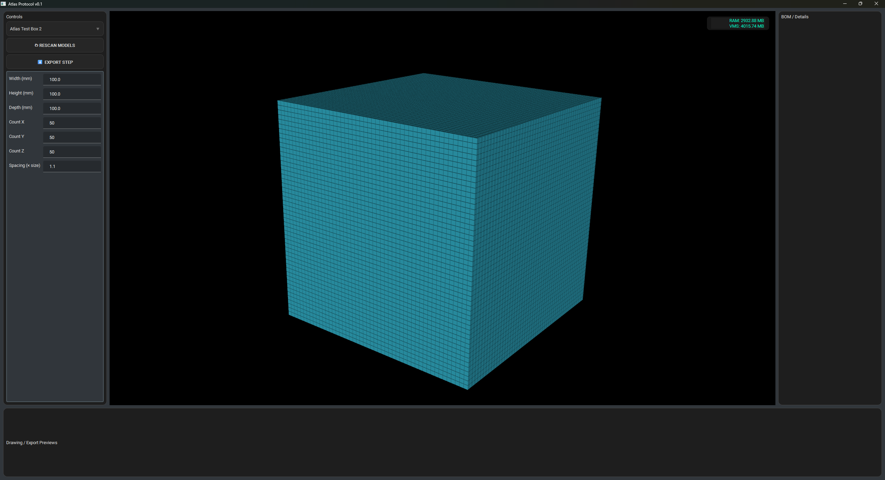

# 🌐 Atlas Protocol

> *“We don’t fix the problem. We fix the reason the problem exists.”*

**Atlas Protocol** is a modular, intent-driven digital design framework that flips the entire design paradigm.  
Instead of designing parts and retrofitting them into systems, Atlas starts from **intent** and builds outward — generating digital twins, ripple-aware revisions, ERP integration, and Git-style versioning for the physical world.

---

## 🚀 What is Atlas?

Atlas isn’t just a tool — it’s a protocol for **co-creating modular systems** from input logic, material constraints, and ripple-safe propagation.

- Twin-first design (not model-last)
- Intent-based geometry generation
- Full part/assembly version control (via **Enigma**)
- Ripple conflict detection + auto-adjustment (via **BOMBE**)
- ERP-aware stock logic and BOM completion (via **Relay**)
- Real-world material availability forecasting (via **Caladan**)
- Performance comparison and stress testing (via **Gauntlet**)

---

## ⚙️ Getting Started

### Windows:
   ```
   git clone hhttps://github.com/ProtoXCode/Atlas-Protocol.git
   pip install -r requirements.txt
   python main.py
   ```

### Linux (Tested on Fedora 42):
   ```
   git https://github.com/ProtoXCode/Atlas-Protocol.git
   pip install -r requirements.txt
   bash tools/setup_linux.sh
   python main.py
   ```

---

## ⚙️ Development Status

- **OCC Wrapper**  
  Built with Pybind11, currently functional with core modeling tools (box, fuse, cut, translate, etc.).  
  Provides direct access to OpenCascade geometry from Python without external dependencies like Conda.

- **GUI**  
  PySide6 + VTK viewer now renders geometry **directly from Python modules** (no intermediate STL/STEP files needed).  
  Live rescan function allows hot-loading of model modules from the `/models` directory.



### 🔜 Next Steps
- Expand OCC wrapper with advanced modeling operations (sheet metal bends, fastener library, etc.).
- Integrate automatic model scanning and intent parsing for richer model metadata.
- Add card-style panels, theme support, and more interactive GUI controls.
- Implement export pipelines for STEP, DXF, and drawing generation directly from the viewer.

---

## 📁 Key Modules

| Module                       | Purpose                                                       |
|------------------------------|---------------------------------------------------------------|
| **Enigma**                   | Git-style versioning for parts and assemblies                 |
| **BOMBE**                    | Ripple analysis + auto-conflict resolution                    |
| **Titan**                    | Constraint-based orchestrator for large-scale design systems  |
| **Relay**                    | ERP interface for BOM matching and stock-aware completion     |
| **Caladan**                  | Material tracking + disruption awareness                      |
| **Gauntlet**                 | Comparative twin testing + benchmarking                       |
| **Atlas Protocol Interface** | Exploded views, ripple shadows, part launching                |

---

## 📦 Features

- 📐 CAD-agnostic design output
- 🌍 Modular API architecture
- 🔄 Git-style branching and forking
- 📊 Auto-generated BOM from full twin model
- 🧠 Open-source logic, AI-ready for future expansion
- 🧩 Open innovation + commercial dual-license model

---

## 📜 License

Atlas is released under the **Atlas Liberation License (ALL)**:
- 🆓 Free for non-commercial, educational, and research use
- 💼 Commercial use requires registration or licensing
- 🚫 Prohibited for oppression, mass surveillance, or civilian-targeted weaponization
- 🔁 Redistribution must preserve open terms and author credit

→ Full license: [LICENSE.txt](./LICENSE.txt)

---

## 📣 Get Involved

> Atlas is a system. A language. A mindset. It’s built to grow — and so are you.

- 🛠 Clone the repo, try the demo, run test modules
- 🧩 Contribute logic templates, intent metadata, or ERP bindings
- 🔗 Connect Atlas to your CAD, MES, or simulation systems
- 🌍 Join the ACE (Atlas Community Edition) movement

---

## 📚 Resources

- 📄 [Whitepaper v1.0](./Atlas_Protocol_Whitepaper_FULL_v1.pdf)
- ✍️ Author: **Tom Erik Harnes**  
  Founder & System Architect, Atlas Protocol  
  [teharnes@gmail.com](mailto:teharnes@gmail.com)  
  [LinkedIn](https://www.linkedin.com/in/tom-erik-harnes/)

---

> **“Digital twins today are copies. Atlas is the origin.”**
